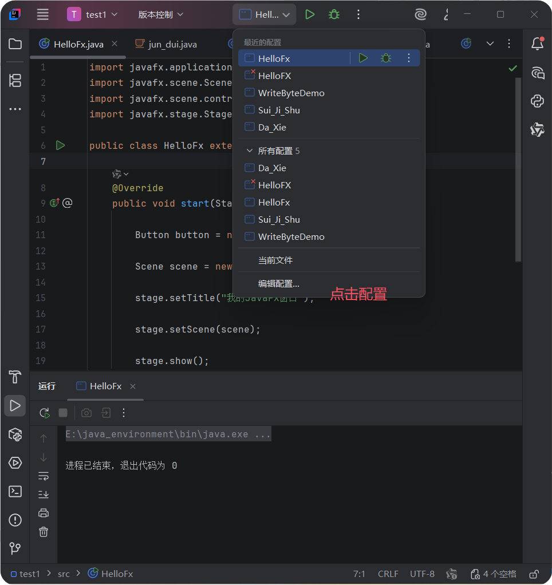
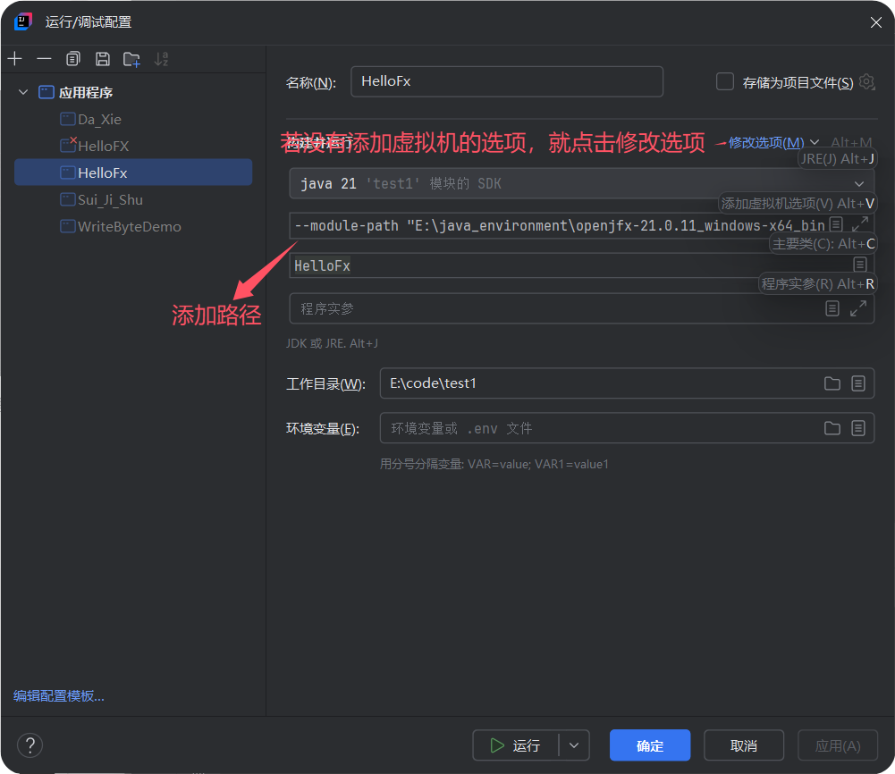

1.
你写的 Java 代码，java.exe用来启动JVM使其运行class文件
        ↓
编译（翻译过程）javac, 将你写的翻译成电脑能够识别的，即将java源码转换为class字节码
        ↓
生成字节码文件（.class）
        ↓
运行（执行），JVM运行
        ↓
屏幕显示结果
2.
Java程序（电影光盘）
JDK
 ├─ 开发工具
 └─ JRE
      ├─ JVM（DVD播放器，负责播放电影），exe只能在windows跑
      └─ Java类库
3.Java代码
   ↓
 javac
   ↓
Bytecode
   ↓
JVM
   ↓
Windows / Linux / Mac

4.
Java源码
↓
javac编译（c语言直接编译成windows机器码，即为编译型，但是只能在windows中运行）
↓
字节码
↓
JVM解释
↓
JIT编译
↓
机器码
所以Java既是编译型语言，又是解释型语言

5.
如果代码是package com.hongyuan.study;
则他的路径应该是：E:\code\com\hongyuan\study\test1.java

6.学习计划
🚀 第一阶段：Java核心基础
✅ 1. OOP

你已经完成：

类与对象
封装
继承
多态
abstract
interface
✅ 2. String

你已经学：

equals
==
split
substring
trim
replace
StringBuilder
✅ 3. 数组与二维数组（已完成）
✅  4. 集合体系（当前进行中）

现在继续学习：

ArrayList
LinkedList
HashSet
HashMap
Iterator
✅  5. 异常体系（）

学习：

try-catch
throw
throws
自定义异常

✅ 6. IO文件系统

学习：

File
输入输出流
缓冲流
序列化
✅ 7. 多线程（非常重要🔥）

学习：

Thread
Runnable
synchronized
锁
线程池

✅ 8. 网络编程

学习：

Socket
TCP/IP
Client/Server

✅ 9. JDBC数据库

学习：

MySQL连接
SQL操作
CRUD
JAVA连接数据库
🚩 10. GUI（JavaFX）

学习：

按钮
输入框
窗口

---
事件机制
(能做简单的桌面程序)

🚀 第二阶段：Java工程开发
🚩 Maven / Gradle

项目管理。

🚩 日志系统

Logback。

🚩 配置文件

YAML / properties。

🚩 单元测试

JUnit。

🚀 第三阶段：Spring Boot（后端核心🔥）

学习：

Controller
Service
Mapper
REST API
🚀 第四阶段：分布式 / 大数据（你的重点）

学习：

Hadoop
Spark
Kafka
HDFS
🚀 第五阶段：AI工程方向（你的长期重点）

学习：

Ollama
Qwen
Agent
向量数据库
AI工作流

我觉得需要调整一下方向，先完成整体的学习，在来深入学习？

# 7.JDK环境变量
## a.(1)更改为JDK21变量
下载的网址：https://adoptium.net/zh-CN/temurin/releases?utm_source=chatgpt.com&version=21&os=any&arch=any
下载的时候记得切换java_home（将不可用转换为安装在磁盘中）--->更改powershell中的版本
(2)然后切换IDEA中的版本
快捷键：SHIFT+CLRL+ALT+S进入界面
选择项目，将其中的SDK修改为JDK21版本
（注意：修改JDK一定是修改整个project的，而不是某一个文件的，一个project只用有一种JDK,因为文件之间可能相互引用）
## b.下载javaFX
安装https://gluonhq.com/products/javafx/
对应版本的 JavaFX SDK（JDK21）
在libraries（库）中选择解压文件中的lib
## c.修改VM options

路径为：`--module-path "E:\java_environment\openjfx-21.0.11_windows-x64_bin-sdk\javafx-sdk-21.0.11\lib" --add-modules javafx.controls,javafx.fxml`
作用：VM options--->JVM启动参数-->给 JVM 增加“库搜索路径”
>原因：
从 JDK9 开始：
Java 引入：
模块化系统（JPMS）
Java 不再：
默认加载所有库
而是：
按模块加载

# 8.导入jdbc
将包直接复制到src文件夹下面，然后点击添加为库。